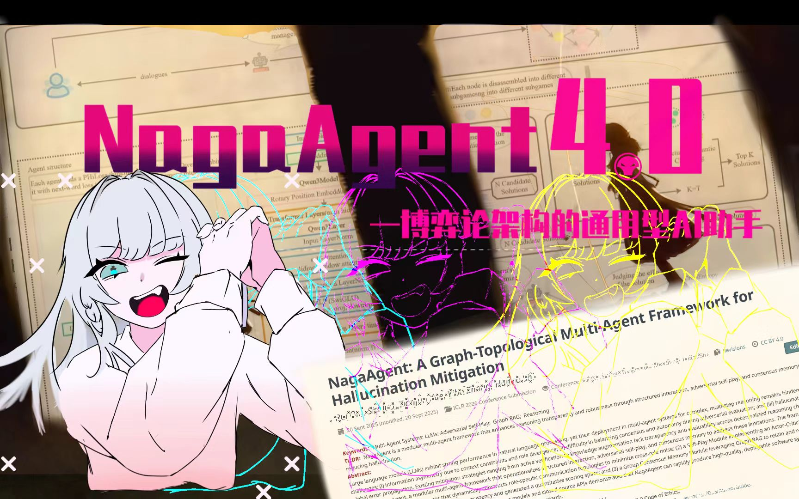

# NagaAgent

[简体中文](README.md) | [繁體中文](README_tw.md) | [English](README_en.md)


   



---

## Overview

NagaAgent is a multi-service conversational assistant built around four independent microservices: an API Server for chat and tool dispatch, an Agent Server for intent analysis and task scheduling, an MCP Server for pluggable tool management, and a Voice Service for speech I/O. It supports GRAG knowledge graph long-term memory, Live2D avatars, streaming chat, the MCP tool protocol, an Electron desktop client, and OpenClaw-based automated task execution.

**[Tutorial Videos & One-Click Runner](https://www.pylindex.top/naga)** | **QQ Bot Integration: [Undefined QQbot](https://github.com/69gg/Undefined/)**

---

## Features

### Chat & Tool Calling

- **Streaming Chat**: Real-time SSE-based streaming output, compatible with any OpenAI-compatible API
- **Streaming Tool Extraction**: Tool calls in LLM output are parsed and executed in real-time during streaming; text is simultaneously sent to the frontend and TTS
- **Multi-round Tool Loop**: Tool results are fed back to the LLM automatically, supporting chained calls with configurable max loop count
- **Document Upload & Parsing**: Upload files and inject parsed content into the conversation context
- **Persistent Context**: Cross-session conversation log persistence with configurable history loading by day count

### Memory System (GRAG)

- **Quintuple Knowledge Graph**: Automatically extracts `(subject, subject_type, predicate, object, object_type)` quintuples from conversations, stored in Neo4j
- **RAG Retrieval**: Relevant memories are automatically retrieved and injected as LLM context during chat
- **Task Manager**: Background concurrent quintuple extraction with queue management, timeout control, and auto-cleanup
- **Remote Memory Service**: Logged-in users connect to cloud NagaMemory automatically, with local fallback when offline
- **Mind Sea Visualization**: Frontend MindView renders a D3.js-based 3D force-directed graph of knowledge graph nodes and relationships

### MCP Tools

A pluggable tool system based on the [Model Context Protocol](https://modelcontextprotocol.io/), with each tool running as an independent agent:

| Tool | Description |
|------|-------------|
| **Weather & Time** | Weather queries, forecasts, system time with automatic city/IP detection |
| **App Launcher** | Scans installed applications, launches programs via natural language |
| **Game Guide** | Game strategy Q&A, damage calculation, team recommendations with auto-screenshot injection |
| **Online Search** | Web search via SearXNG |
| **Web Crawler** | Web content extraction via Crawl4AI |
| **Browser Automation** | Browser control via Playwright |
| **Vision** | Screenshot analysis and visual Q&A |
| **MQTT IoT** | IoT device control via MQTT protocol |
| **Office Documents** | docx/xlsx content extraction |

Additional community skills can be installed via the Skill Market (Agent Browser, Brainstorming, Context7, Firecrawl Search, etc.).

### Agent Server & Task Scheduling

- **Intent Analysis**: A game-theory-based background analyzer that asynchronously analyzes user intent and generates executable agent_calls
- **OpenClaw Integration**: Connects to the OpenClaw Gateway to dispatch AI coding assistants for computer tasks via natural language
- **Task Orchestration**: Task Scheduler manages task lifecycle with step recording, session association, and compressed memory

### Voice Interaction

- **Text-to-Speech (TTS)**: Edge-TTS based, OpenAI-compatible endpoint `/v1/audio/speech`, supporting streaming playback, smart sentence splitting, and multiple audio formats
- **Speech Recognition (ASR)**: FunASR based, supporting VAD endpoint detection, WebSocket real-time streaming, and multiple languages
- **Real-time Voice Chat**: Full-duplex voice interaction using Qwen Omni models, with echo suppression and voice activity detection

### Frontend & UI

Two frontend options:

- **Electron + Vue 3 Desktop**: Vite build, UnoCSS + PrimeVue, Live2D model rendering (pixi-live2d-display), gaze tracking, splash animation, floating ball mode, system tray
- **PyQt5 Native GUI**: Live2D integration, MVC architecture, system tray minimization

**Electron Frontend Features**:
- Splash screen: Brand title animation + particle effects + progress bar sync + Live2D fade-in
- Chat view: Markdown rendering, tool call status display, voice input button, file upload
- Mind Sea: Knowledge graph 3D visualization and search
- Skill Market: MCP service status, community skill installation
- Live2D model selection and configuration
- Memory management: GRAG parameter configuration, Neo4j connection status
- System config: All settings hot-editable with real-time backend sync
- NagaCAS authentication + captcha + token refresh + session expiry handling

---

## Architecture

```
┌──────────────────────────────────────────────────────────┐
│                 Electron / PyQt5 Frontend                 │
│  Vue 3 + Vite + UnoCSS + PrimeVue + pixi-live2d-display  │
└────────────┬────────────┬────────────┬───────────────────┘
             │            │            │
     ┌───────▼──────┐ ┌──▼──────┐ ┌──▼──────┐
     │  API Server  │ │ Agent   │ │  Voice  │
     │   :8000      │ │ Server  │ │ Service │
     │              │ │  :8001  │ │  :5048  │
     │ - Chat/SSE   │ │         │ │         │
     │ - Tool calls │ │ - Intent│ │ - TTS   │
     │ - Documents  │ │   analysis│ │ - ASR │
     │ - Auth proxy │ │ - Task  │ │ - Real  │
     │ - Memory API │ │   sched │ │   time  │
     │ - Skill Mkt  │ │ - Open  │ │         │
     │ - Config     │ │   Claw  │ │         │
     └──────┬───────┘ └────┬────┘ └─────────┘
            │              │
     ┌──────▼──────┐  ┌───▼──────────┐
     │ MCP Server  │  │   OpenClaw   │
     │   :8003     │  │   Gateway    │
     │             │  └──────────────┘
     │ - Registry  │
     │ - Discovery │
     │ - Parallel  │
     └──────┬──────┘
            │
    ┌───────┴──────────────────────┐
    │   MCP Agents (pluggable)     │
    │ Weather | Search | Crawl     │
    │ Launcher | Guide | MQTT ...  │
    └──────────────────────────────┘
            │
     ┌──────▼──────┐
     │   Neo4j     │
     │   :7687     │
     │  Knowledge  │
     │   Graph     │
     └─────────────┘
```

### Directory Structure

```
NagaAgent/
├── apiserver/            # API Server - chat, tool calls, auth, config
├── agentserver/          # Agent Server - intent analysis, task scheduling, OpenClaw
├── mcpserver/            # MCP Server - tool registration & dispatch
│   ├── agent_weather_time/       # Weather & time
│   ├── agent_open_launcher/      # App launcher
│   ├── agent_game_guide/         # Game guide
│   ├── agent_online_search/      # Online search
│   ├── agent_crawl4ai/           # Web crawler
│   ├── agent_playwright_master/  # Browser automation
│   ├── agent_vision/             # Vision
│   └── agent_mqtt_tool/          # MQTT IoT
├── summer_memory/        # GRAG knowledge graph - quintuple extraction, Neo4j, RAG
├── voice/                # Voice service - TTS (Edge-TTS) + ASR (FunASR)
├── guide_engine/         # Game guide engine - cloud RAG service
├── frontend/             # Electron + Vue 3 frontend
│   ├── electron/         # Electron main process
│   └── src/              # Vue 3 app
├── ui/                   # PyQt5 GUI (MVC)
├── system/               # Config loader, env checker, system prompts
├── nagaagent_core/       # Core library
├── main.py               # Unified entry point, orchestrates all services
├── config.json           # Runtime config (copy from config.json.example)
└── pyproject.toml        # Project metadata & dependencies
```

---

## Quick Start

### Requirements

- Python 3.11 (`>=3.11, <3.12`)
- Optional: [uv](https://github.com/astral-sh/uv) (faster dependency installation)
- Optional: Neo4j (knowledge graph memory)

### Installation

```bash
# Clone the repository
git clone https://github.com/Xxiii8322766509/NagaAgent.git
cd NagaAgent

# Option 1: Setup script (auto-detects env, creates venv, installs deps)
python setup.py

# Option 2: Using uv
uv sync

# Option 3: Manual
python -m venv .venv
source .venv/bin/activate  # Windows: .\.venv\Scripts\activate
pip install -r requirements.txt
```

### Configuration

Copy `config.json.example` to `config.json` and fill in your LLM API credentials:

```json
{
  "api": {
    "api_key": "your-api-key",
    "base_url": "https://api.deepseek.com/v1",
    "model": "deepseek-v3.2"
  }
}
```

Works with any OpenAI-compatible API (DeepSeek, Qwen, OpenAI, Ollama, etc.).

### Launch

```bash
python main.py             # Full launch (API + Agent + MCP + Voice + GUI)
uv run main.py             # Using uv
python main.py --headless  # Headless mode (for use with Electron frontend)
```

All services are orchestrated by `main.py`. For development, each can be started independently:

```bash
uvicorn apiserver.api_server:app --host 127.0.0.1 --port 8000 --reload
uvicorn agentserver.agent_server:app --host 0.0.0.0 --port 8001
```

### Electron Frontend Development

```bash
cd frontend
npm install
npm run dev    # Dev mode (Vite + Electron)
npm run build  # Production build
```

---

## Optional Configuration

<details>
<summary><b>Knowledge Graph Memory (Neo4j)</b></summary>

Install Neo4j ([Docker](https://hub.docker.com/_/neo4j) or [Neo4j Desktop](https://neo4j.com/download/)), then configure:

```json
{
  "grag": {
    "enabled": true,
    "neo4j_uri": "neo4j://127.0.0.1:7687",
    "neo4j_user": "neo4j",
    "neo4j_password": "your-password"
  }
}
```
</details>

<details>
<summary><b>Voice Interaction</b></summary>

```json
{
  "system": { "voice_enabled": true },
  "tts": { "port": 5048, "default_voice": "zh-CN-XiaoxiaoNeural" }
}
```

Real-time voice chat (requires Qwen DashScope API Key):

```json
{
  "voice_realtime": {
    "enabled": true,
    "provider": "qwen",
    "api_key": "your-dashscope-key",
    "model": "qwen3-omni-flash-realtime"
  }
}
```
</details>

<details>
<summary><b>Live2D Avatar (PyQt5 GUI)</b></summary>

```json
{
  "live2d": {
    "enabled": true,
    "model_path": "path/to/your/model.model3.json"
  }
}
```
</details>

<details>
<summary><b>MQTT IoT</b></summary>

```json
{
  "mqtt": {
    "enabled": true,
    "broker": "mqtt-broker-address",
    "port": 1883,
    "topic": "naga/agent/topic"
  }
}
```
</details>

---

## Ports

| Service | Port | Description |
|---------|------|-------------|
| API Server | 8000 | Main interface: chat, config, auth, Skill Market |
| Agent Server | 8001 | Intent analysis, task scheduling, OpenClaw |
| MCP Server | 8003 | MCP tool registration & dispatch |
| Voice Service | 5048 | TTS / ASR |
| Neo4j | 7687 | Knowledge graph (optional) |

---

## Updating

```bash
python update.py  # Auto git pull + dependency sync
```

---

## Troubleshooting

| Issue | Solution |
|-------|----------|
| Python version mismatch | Use Python 3.11, or use uv (manages Python versions automatically) |
| Port in use | Check if ports 8000, 8001, 8003, 5048 are available |
| Neo4j connection failed | Ensure Neo4j is running, verify config.json connection parameters |
| Progress bar stuck | Check if API key is configured correctly; try restarting the app in Electron |

```bash
# Environment diagnostics
python main.py --check-env --force-check
python main.py --quick-check
```

---

## Building

```bash
python build.py  # Build Windows one-click runner package, output to dist/
```

---

## Contributing

Issues and Pull Requests are welcome.

---

## License

[MIT License](LICENSE)

---

## Star History

[](https://www.star-history.com/#Xxiii8322766509/NagaAgent&type=date&legend=top-left)
